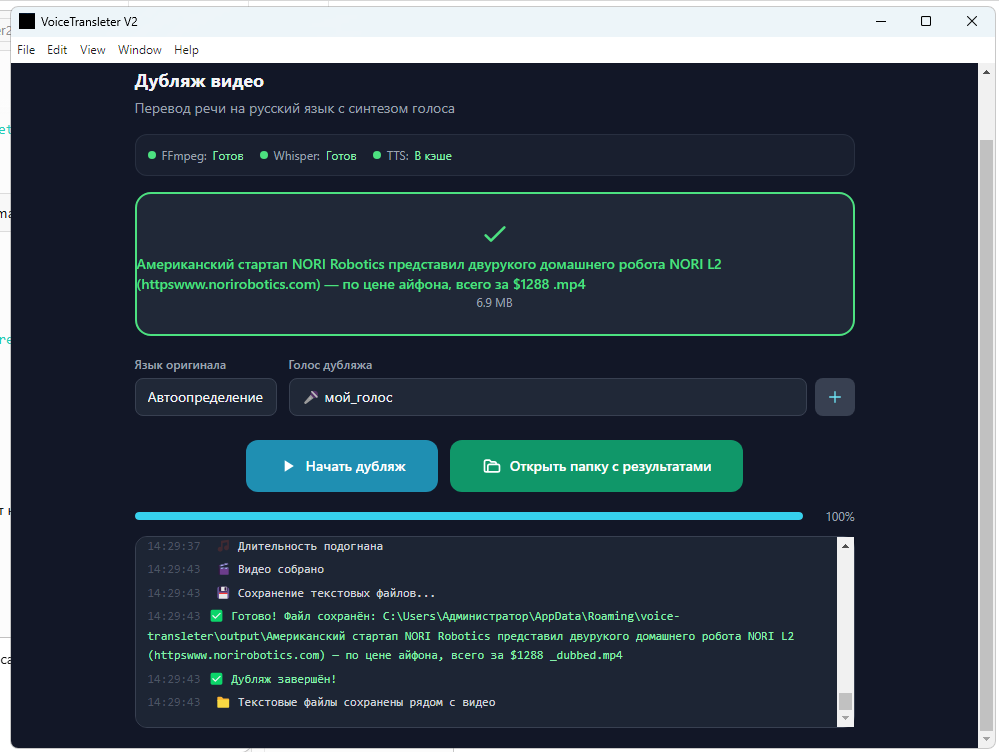

# VoiceTransleter V2

Дубляж видео с переводом речи на русский язык с синтезом голоса (любой язык → RU).

**Версия:** 2.1.7

**Разработчик:** Андраник Алавердян (AndranikFutureLabs)  
**Поддержка:** [@AndranikFutureLabs](https://t.me/AndranikFutureLabs)  
**Канал разработчика:** [@AndranikFutureLabsChannel](https://t.me/AndranikFutureLabsChannel)  
**Сайт:** https://andranik-future-labs.ru  
**GitHub:** https://github.com/AndranikFutureLabs/VoiceTransleter_V2



---

## О программе

VoiceTransleter V2 — десктопное приложение для автоматического дубляжа видео. Распознаёт речь на любом языке (Whisper), переводит на русский, синтезирует голос (XTTS v2 с клонированием голоса) и встраивает новую аудиодорожку в видео.

---

## Возможности

- **Распознавание речи** — faster-whisper (модель medium, CTranslate2, int8 CPU)
- **Автоопределение языка** оригинала
- **Перевод на русский** через Google Translate
- **Синтез речи** — XTTS v2 (Coqui TTS) с клонированием голоса по WAV-образцу
- **Глобальная синхронизация** — аудио растягивается под длительность видео (единый коэффициент)
- **Сохранение текстов** — 8 файлов: SRT с таймингами и plain, исходный текст, перевод, транслитерация
- **Голосовые профили** — сохранение нескольких образцов голоса
- **Трей** — свёртка в системный лоток

---

## Что нового в версии 2.1.1

- **Автоматическая установка Python-зависимостей** — приложение само устанавливает `faster-whisper` и `TTS` через `pip` при первом запуске
- **Индикаторы Python в UI** — статус Python и пакетов отображается рядом с FFmpeg/Whisper/TTS
- **Исправление:** `ModuleNotFoundError: No module named 'faster_whisper'` на чистых установках

## Что нового в версии 2.1.7

- **Исправлена установка TTS** — увеличен таймаут до 30 мин, предустановка numpy/cython, повтор с `--no-build-isolation`
- **Версия в интерфейсе** обновлена до 2.1.7

## Что нового в версии 2.1.6

- **Embedded Python** — скачивание zip-архива вместо .exe установщика (не нужны права админа)

## Что нового в версии 2.1.5

- **Автоустановка Python 3.11** даже если Python не найден в системе

## Что нового в версии 2.1.4

- **Метаданные издателя** — UAC показывает AndranikFutureLabs вместо «Неизвестный издатель»

## Что нового в версии 2.1.3

- **Автозагрузка Python 3.11** при несовместимой версии (3.12+)

## Что нового в версии 2.1.2

- **Проверка версии Python** (3.9–3.11) перед установкой пакетов

## Что нового в версии 2.1.1

- **Автоматическая установка Python-зависимостей** — `faster-whisper` и `TTS` ставятся через `pip` при первом запуске

## Что нового в версии 2.1.0

- **Кроссплатформенная поддержка** — сборки для macOS (Intel + Apple Silicon) и Linux (AppImage + deb)
- **GitHub Actions CI** — автоматическая сборка под все платформы при пуше в репозиторий
- **Кроссплатформенный Python** — автоматическое определение `python3` / `python` / `py` в зависимости от ОС
- **Кроссплатформенное открытие папок** — `explorer` (Windows), `open` (macOS), `xdg-open` (Linux)
- **Исправлен tray icon** — корректный путь к иконке в production-сборках на всех платформах
- **Убран хардкод** — удалён прописанный путь `C:\kinescope-desktop\bin` из кода

## Что нового в версии 2.0.0

- **Полный переход на Electron** — нативное десктопное приложение (Windows), больше не Python GUI
- **Python sidecar архитектура** — Whisper и TTS работают как отдельные Python-процессы (JSON stdin/stdout)
- **faster-whisper (CTranslate2)** вместо transformers.js — никаких блокировок `.onnx` файлов
- **XTTS v2** — клонирование голоса, мультиязычный синтез (16 языков)
- **Глобальный time-stretch** — вся звуковая дорожка равномерно растягивается под длительность видео
- **Голосовые профили** — сохранение множества голосов, переключение между ними
- **Современный UI** — Vue 3 + TypeScript + Tailwind CSS, тёмная тема
- **Трей-иконка** — работа в фоне

---

## Технологии

| Компонент | Технология |
|-----------|-----------|
| Интерфейс | Electron 33 + Vue 3 + TypeScript + Tailwind CSS |
| Распознавание речи | faster-whisper (Python, CTranslate2, модель medium) |
| Перевод | google-translate-api-x |
| Синтез речи | Coqui TTS — XTTS v2 (Python) |
| Обработка видео | FFmpeg (system или встроенный) |
| Аудиомикшер | Node.js Int16Array (программный WAV-микшер) |
| Сборка | electron-vite + electron-builder (NSIS) |

---

## Установка

### Windows

#### Вариант 1: Готовый установщик (рекомендуется)

1. Скачайте последний релиз: `VoiceTransleter V2 Setup 2.1.7.exe`
2. Запустите установщик
3. Следуйте инструкциям мастера установки
4. После установки запустите программу через ярлык на рабочем столе или меню Пуск
5. При первом запуске нажмите **«Загрузить модели»** — будут загружены Whisper medium (~1.5 ГБ) и XTTS v2 (~2.5 ГБ)

#### Вариант 2: Portable

1. Скачайте и распакуйте `win-unpacked.zip`
2. Запустите `VoiceTransleter V2.exe`

#### Вариант 3: Сборка из исходников

**Требования:**
- Node.js 20+
- Python 3.10–3.11
- Git

```bash
# Клонирование
git clone https://github.com/AndranikFutureLabs/VoiceTransleter_V2.git
cd VoiceTransleter_V2

# Установка Node.js зависимостей
npm install

# Установка Python зависимостей
pip install faster-whisper TTS

# FFmpeg — скачайте ffmpeg.exe и ffprobe.exe
# Положите в папку resources/ проекта

# Запуск в режиме разработки
npm run dev

# Сборка дистрибутива
npm run dist
```

### macOS / Linux

Начиная с версии 2.1.0, VoiceTransleter V2 поддерживает сборку под macOS и Linux через GitHub Actions.

#### Вариант 1: Готовые сборки

1. Скачайте артефакты сборки со страницы [GitHub Actions](https://github.com/AndranikFutureLabs/VoiceTransleter_V2/actions)
2. **macOS:** распакуйте `.dmg` файл, перетащите приложение в Applications
3. **Linux:** сделайте AppImage исполняемым (`chmod +x VoiceTransleter*.AppImage`) и запустите

#### Вариант 2: Сборка из исходников

```bash
# Требования
# Node.js 20+, Python 3.10+, FFmpeg, Git

git clone https://github.com/AndranikFutureLabs/VoiceTransleter_V2.git
cd VoiceTransleter_V2

# Node.js зависимости
npm install

# Python зависимости
pip3 install faster-whisper TTS

# FFmpeg — должен быть в PATH
# macOS:  brew install ffmpeg
# Linux:  sudo apt install ffmpeg

# Запуск
npm run dev

# Сборка под macOS
npm run dist:mac

# Сборка под Linux
npm run dist:linux
```

---

## Использование

### Первый запуск

1. После установки запустите VoiceTransleter V2
2. Нажмите кнопку **«Загрузить модели»** (потребуется интернет ~4 ГБ):
   - faster-whisper medium (~1.5 ГБ) — скачивается один раз
   - XTTS v2 (~2.5 ГБ) — скачивается один раз
3. Дождитесь окончания загрузки — статус моделей загорится зелёным

### Дубляж видео

1. Перетащите видеофайл в область загрузки или нажмите на неё для выбора
2. Выберите язык оригинала (или оставьте автоопределение)
3. Выберите голос дубляжа:
   - Если у вас есть образец голоса — добавьте его через **«Добавить голос»**
   - Если образца нет — будет использован заглушка (рекомендуется загрузить)
4. Нажмите **«Начать дубляж»**
5. Процесс отображается в логе и прогресс-баре:
   - **Шаг 1/5** — извлечение аудио из видео
   - **Шаг 2/5** — распознавание речи (Whisper)
   - **Шаг 3/5** — перевод на русский
   - **Шаг 4/5** — синтез речи (XTTS, ~10-30 сек на сегмент)
   - **Шаг 5/5** — сборка финального видео
6. После завершения появится кнопка **«Открыть папку с результатами»**

### Голосовые профили

1. Нажмите **«Добавить голос»**
2. Выберите WAV-файл с образцом голоса (10–30 секунд чистого голоса)
3. Введите название профиля
4. Голос появится в выпадающем списке выбора голоса

### Результаты

После дубляжа в папке `%APPDATA%\voice-transleter\output\` создаются файлы:

| Файл | Описание |
|------|----------|
| `*_dubbed.mp4` | Готовое видео с дубляжом |
| `*_source.txt` | Исходный текст (SRT) |
| `*_source_plain.txt` | Исходный текст без таймингов |
| `*_translation.txt` | Перевод на русский (SRT) |
| `*_translation_plain.txt` | Перевод без таймингов |
| `*_source_translit.txt` | Транслитерация оригинала (SRT) |
| `*_source_translit_plain.txt` | Транслитерация оригинала без таймингов |
| `*_translation_translit.txt` | Транслитерация перевода (SRT) |
| `*_translation_translit_plain.txt` | Транслитерация перевода без таймингов |

---

## Структура проекта

```
VoiceTransleter_V2/
├── src/                          # Vue 3 фронтенд
│   └── renderer/
│       └── src/
│           ├── App.vue           # Главный компонент
│           ├── components/       # Компоненты UI
│           └── env.d.ts          # Типы для electronAPI
├── electron/                     # Electron бэкенд
│   ├── main/
│   │   ├── index.ts             # Главный процесс (IPC, Tray, окно)
│   │   ├── whisper.ts           # Whisper sidecar (faster-whisper)
│   │   ├── tts.ts               # TTS sidecar (XTTS v2)
│   │   ├── pipeline.ts          # Пайплайн дубляжа
│   │   ├── translator.ts        # Перевод (Google Translate)
│   │   ├── ffmpeg.ts            # FFmpeg/FFprobe утилиты
│   │   └── voice_profiles.ts    # Голосовые профили
│   └── preload/
│       └── index.ts             # Preload (contextBridge)
├── scripts/                      # Python sidecar'ы
│   ├── whisper_server.py        # faster-whisper сервер
│   └── tts_server.py            # XTTS v2 сервер
├── resources/                    # Ресурсы (FFmpeg, иконки)
├── out/                          # Скомпилированный JS
├── dist/                         # Дистрибутивы
├── package.json
├── electron-builder.yml
├── tailwind.config.js
├── tsconfig.json
└── AGENTS.md                     # Контекст для ИИ-ассистентов
```

---

## Кэш и пути

| Данные | Путь |
|--------|------|
| Модель Whisper | `%USERPROFILE%\.cache\faster-whisper\` |
| Модель XTTS | `%LOCALAPPDATA%\tts\` |
| Временные файлы | `%APPDATA%\voice-transleter\temp\` |
| Результаты | `%APPDATA%\voice-transleter\output\` |
| Голосовые образцы | `%APPDATA%\voice-transleter\voices\` |
| FFmpeg (загруженный) | `%APPDATA%\voice-transleter\ffmpeg-bin\` |

---

## Системные требования

- **ОС:** Windows 10/11 (x64), macOS 11+ (Intel/Apple Silicon), Linux (Ubuntu 20.04+ / x64)
- **ОЗУ:** 8+ ГБ (рекомендуется 16 ГБ)
- **Диск:** 10+ ГБ свободного места (модели ~4 ГБ)
- **Интернет:** требуется для первой загрузки моделей
- **CPU:** любой x64 с поддержкой AVX (рекомендуется 4+ ядер)
- **Python:** 3.10–3.11 (для Whisper и TTS sidecar)
- **FFmpeg:** должен быть установлен или доступен в PATH

---

## Устранение неполадок

### NSIS Error при установке
Переустановите с правами администратора. Если ошибка повторяется — используйте portable версию.

### Ошибка загрузки моделей
Проверьте подключение к интернету. При необходимости используйте зеркало Hugging Face:
```bash
set HF_ENDPOINT=https://hf-mirror.com
```

### FFmpeg не найден
- Скачайте [FFmpeg](https://ffmpeg.org/download.html)
- Поместите `ffmpeg.exe` и `ffprobe.exe` в папку `resources/` проекта
- Или нажмите **«Загрузить FFmpeg»** в приложении

### Медленный синтез
XTTS v2 на CPU — ресурсоёмкий процесс. RTF ~3.0 (1 секунда речи = 3 секунды синтеза). Для ускорения:
- Используйте более короткие видео (до 5 минут)
- Уменьшите количество сегментов (Whisper сам разбивает)

---

## Лицензия

MIT License

Copyright (c) 2026 Андраник Алавердян (AndranikFutureLabs)

---

## Контакты

- **Поддержка:** [@AndranikFutureLabs](https://t.me/AndranikFutureLabs)
- **Канал:** [@AndranikFutureLabsChannel](https://t.me/AndranikFutureLabsChannel)
- **Сайт:** https://andranik-future-labs.ru
- **GitHub:** https://github.com/AndranikFutureLabs/VoiceTransleter_V2
